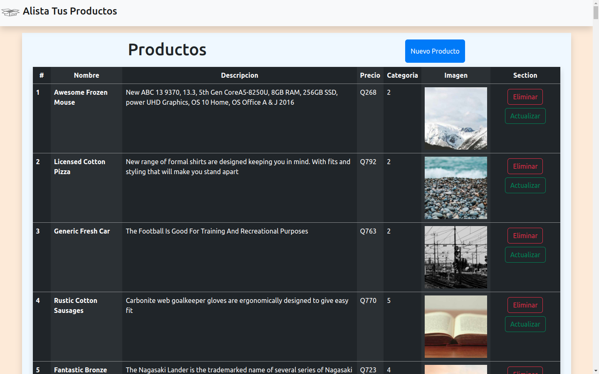

# CRUD
## En este proyecto aprendimos a implementar conceptos sobre como manejar y utlizar un CRUD y como recrearlo en un pagina utilizando una API de platzi, sobre productos, en este podemos eliminar, agregar, editar y crear un producto utilizando la regla del CRUD.

# ejemplo de web
